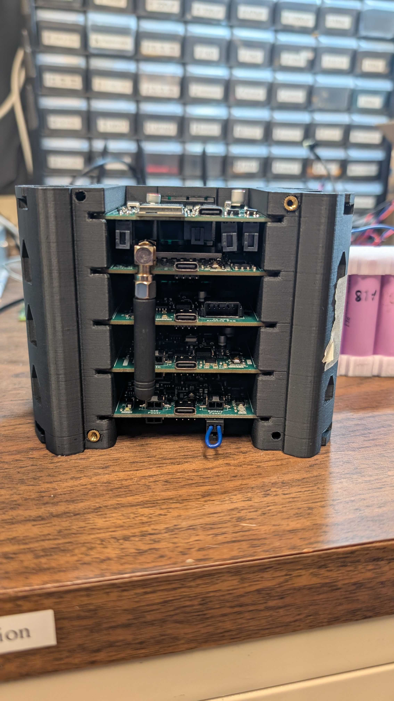
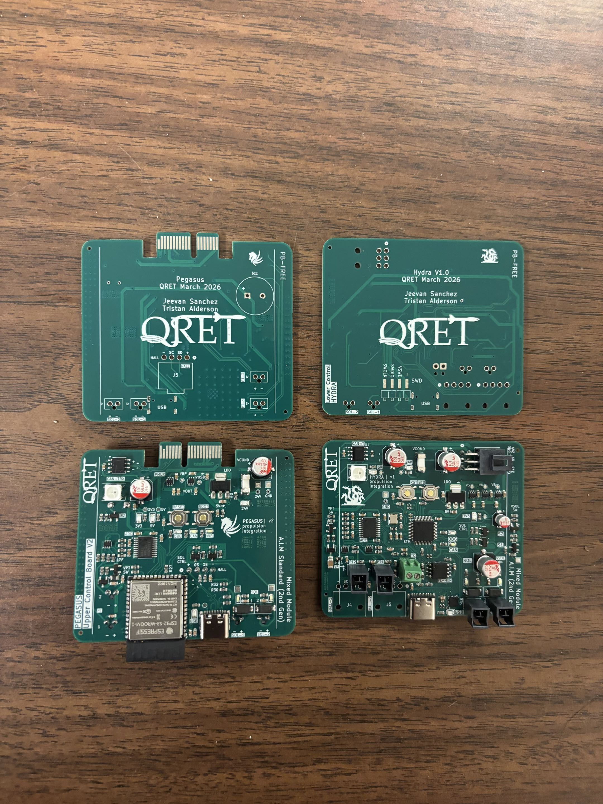

# Propulsion Integration Systems
> 2025-2026 Season - Propulsion Integration Projects

  
  

- Repository contains Avionics schematics, PCBs, and firmware for integrating with the propulsion stack.

### Folder Structure
- [`/Schematics`](./Schematics/) : Electrical design files (KiCad V8)  
- [`/Firmware`](./Firmware/) : C/C++ Code
- [`/Datasheets`](./Datasheets/) : Datasheets and reference materials  

### Documentation
- Boards and code are documented through `README` files in their respective directories. 

### Usage 
- To add or update features and work on new projects, create a new branch. 
- For **PCB** projects, name the branch with the convention: `pcb/board-name` or `pcb/board-feature` for updates.
- For **firmware** projects, name the branch with the convention: `fw/project-name` or `fw/project-feature` for updates.

--- 

QRET Avionics 25/26