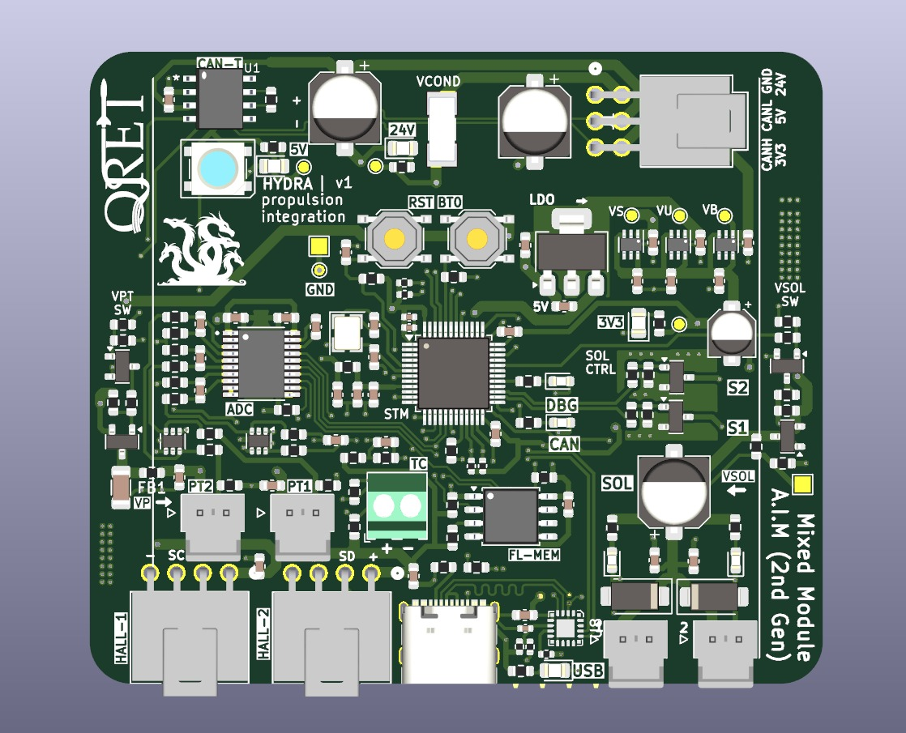

# Lower Control Board (HYDRA) Documentation

<strong>Table of Contents</strong>

- [Lower Control Board (HYDRA) Documentation](#lower-control-board-hydra-documentation)
  - [Overview](#overview)
    - [Key Features](#key-features)
    - [System Architecture](#system-architecture)
  - [Circuit Deisgn](#circuit-deisgn)
    - [Schematics](#schematics)
    - [Key Circuits](#key-circuits)
  - [Board Design](#board-design)
  - [Revision History](#revision-history)
  - [Contributors](#contributors)

## Overview

<em>Fig. 1: 3D-rendered view of the lower control board.</em>

### Key Features
### System Architecture

## Circuit Deisgn 

### Schematics 
### Key Circuits

## Board Design

## Revision History

## Contributors
- Jeevan Sanchez, Tristan Alderson

--- 

QRET Avionics 25/26