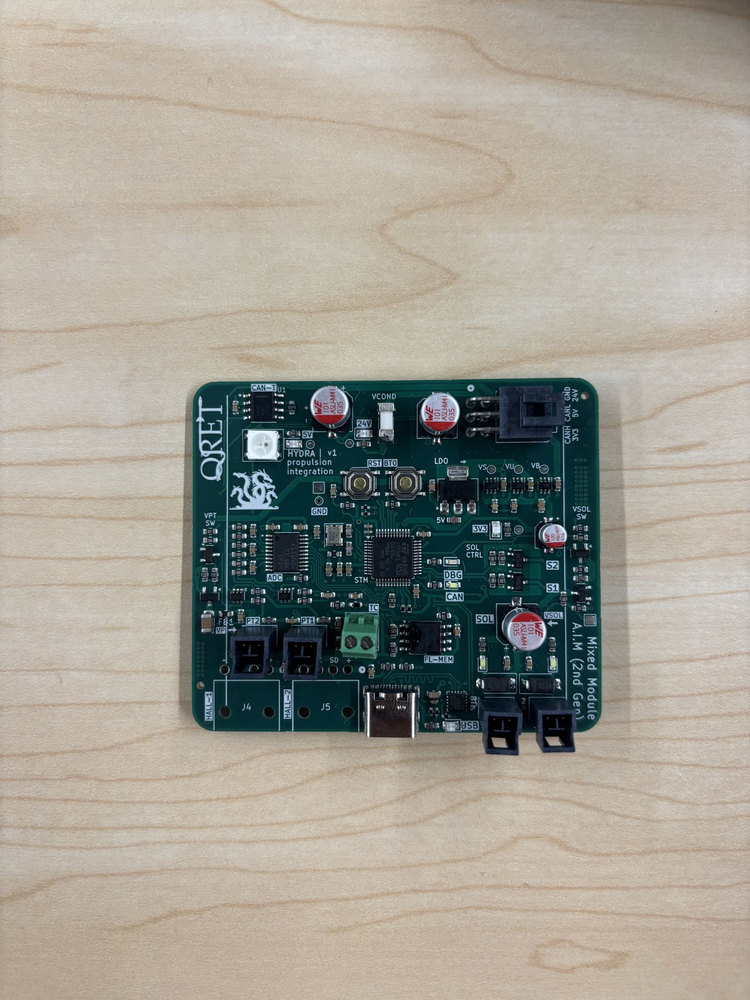
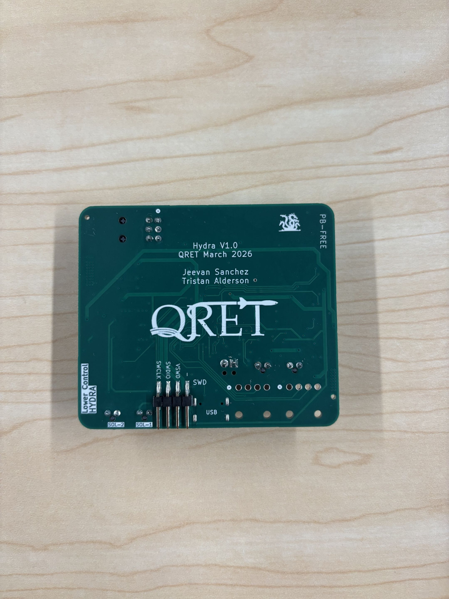

# Lower Control Board (HYDRA) Documentation

<!--- removed left align div - weird github web issue --->

<strong>Table of Contents</strong>

  
- [Lower Control Board (HYDRA) Documentation](#lower-control-board-hydra-documentation)
  - [Overview](#overview)
    - [Key Features](#key-features)
  - [Circuit Design](#circuit-design)
    - [Power Management](#power-management)
      - [Power Entry](#power-entry)
      - [Power MUX](#power-mux)
      - [Power Switching](#power-switching)
    - [MCU Breakout](#mcu-breakout)
      - [Mode Selection](#mode-selection)
      - [Flash Storage Module](#flash-storage-module)
      - [CANBUS Interface](#canbus-interface)
      - [Serial Wire Debug](#serial-wire-debug)
      - [USB Interface](#usb-interface)
      - [System Feedback](#system-feedback)
    - [Valve Control](#valve-control)
    - [Sensing](#sensing)
      - [Data Acquisition](#data-acquisition)
      - [Pressure Transducers](#pressure-transducers)
      - [Thermocouples](#thermocouples)
  - [Board Design](#board-design)
    - [Physical Design Notes](#physical-design-notes)
    - [Electrical Characteristics](#electrical-characteristics)
    - [System Partitioning](#system-partitioning)
  - [Revision History](#revision-history)
  - [Contributors](#contributors)

---

## Overview

  
  
  

<em>Fig. 1: Hydra</em>

The **Lower LC/Hydra** board is a control board designed for integration with the rocket's propulsion system.
It operates in the **lower valve bay**, and drives solenoids to control the **dump** and **fill** valves.
This board supports analog pressure and temperature sensing, two digital hall-effect sensors for solenoid-status reading, and communication with the rest of the stack through CANbus.

Interfaces with:
- STM32F1 MCU
- Two 24V 205292 Solenoids
- Two 24V 4-20mA Pressure Transducers (PT)
- An Omega SA3-K Thermocouple (TC)
- Two TMAG273 digital hall-effect sensors (via breakout board)

### Key Features

- STM32F1 microcontroller with additional memory
- I2C and SPI interfaces for sensor integration
- Controlled power delivery for sensors and solenoids
- ORing circuits for power management
- Visual indication for status and debugging
- 4-layer PCB with dedicated ground planes
- Protection and filtering components across board

---

## Circuit Design

This board is primarily composed of four circuit modules representing its critical systems: [Power Management](#power-management), [STM32 Breakout](#mcu-breakout), [Valve Control](#valve-control), and [Sensing](#sensing).

All schematics are available as `kicad_sch` files in this directory.

---

### Power Management

This board receives power from the Hybrid Power Module through the Backplane.
For more information on power delivery, check out [this repository](https://github.com/Queens-Rocket-Engineering-Team/av-power).

The supply delivers **three** levels of voltage to the board:

| Voltage (V) | Purpose |
|-------------|---------|
| 3.3 | Logic supply for microcontroller and other peripheral devices; also serves as a reference for signal conditioning and protection circuits |
| 5 | Intermediate supply for specific peripheral devices |
| 24 | High-voltage supply for driving external devices such as solenoids and sensors |

> **Note:** 3.3V is referred to as **3V3** throughout this document.

#### Power Entry

Power rails enter through a Molex Micro-Fit connector and are conditioned by bulk filtering and input protection circuitry. These circuits apply to the 5V and 24V rails, each decoupled with 100 µF electrolytic capacitors to handle voltage transients and provide local energy storage. The 24V rail includes a 2A fuse for overcurrent protection.

Other power sources come from communication devices such as the USB connection and the JTAG debugger. The USB creates a voltage rail of 5V, which is then stepped down to 3V3 with a **Low-Dropout Regulator (LDO)**. The JTAG debugger supplies 3V3.

All rails feature test points and LEDs for diagnosis and debugging.

#### Power MUX

Power Multiplexers (MUX) are circuits that select between multiple power inputs to drive a single load. This is needed to avoid back-feeding between power sources, which could lead to unintended powering of interfaces and potential damage.

This implementation uses a **Triple OR-ing** circuit to select between three 3.3V inputs: Backplane (V_BP), JTAG (V_SWD), and USB (V_USB).

- The circuit involves three Ideal Diode ICs, which use a MOSFET and controller to mimic the behaviour of an **Ideal Diode** (zero voltage drop when forward-biased, zero current when reverse-biased).
- The logic follows:
  - **ON condition**: A chip turns on if its *Vin* is **higher** than the common output rail *Vout*.
  - Each chip uses its enable *CE* pin to monitor the output rail; if it sees a higher voltage present, it remains closed to prevent back-feeding.

In summary, a source will only drive the load if its voltage is higher than the current voltage on the output rail, allowing only **one** source to drive the output rail at a time.

- Capacitors are placed at the input pins to filter noise and prevent voltage spikes when a source is suddenly connected or disconnected.
- On the output rail, capacitors act as reservoirs to maintain steady voltage while also filtering noise generated by the loads connected to the 3V3 rail.

#### Power Switching

The delivery of 24V to the pressure transducers and solenoids is controlled through a switching circuit.

- For PTs, this was added to reduce power consumption by enabling sensor power only during active operation.
- For solenoids, this was added as a pre-actuation layer to provide additional protection and controlled switching.
- The controlled output rails are identified as `VPT` and `VSOL` respectively.

The circuit uses a **CMOS** (dual-MOSFET) setup: one N-channel at the input to drive a P-channel for the output.

**MOSFET Basics**

| Type | ON Condition |
|------|-------------|
| N-Channel | Gate voltage higher than source -> VGS > Vth |
| P-Channel | Gate voltage lower than source -> VGS < Vth |

The **ON** state connects the **Drain** (output) pin to the **Source** pin.

**Logic**

- The STM32 outputs a digital signal to drive the gate of the N-channel MOSFET. The source of the MOSFET is set to GND (0V).
- The gate is now at a higher voltage than the source, setting the drain to GND.
- The drain connects to a resistor divider with 24V to drive the gate of the P-channel MOSFET. The source of the MOSFET is set to 24V.
  - The resistor divider limits the gate voltage to approximately 14.81 V, lower than the source, setting the drain to 24V and powering the output rail.

$$V_g = 24 \times \frac{10k}{(6.2k + 10k)} \approx 14.81\ \text{V}$$

$$V_{gs} = 14.81 - 24 \approx -9.19\ \text{V}$$

> From the [DMP4065 Datasheet](${KIPRJMOD}/../../Datasheets/pMOSFET_DMP4065S-7_DS.pdf), VGS(max) = ±20 V, within safe operating range.

- `VPT` is filtered using a Pi filter with a ferrite bead between a 10 µF bulk capacitor and a 0.1 µF decoupling capacitor to reduce ripple and high-frequency noise.
- `VSOL` is decoupled with a 100 µF electrolytic capacitor for local energy storage and transient support.
- `VSOL` also uses a voltage divider for sensing. Two resistors (100 kΩ and 10 kΩ) scale the 24V input down to approx. 2.18V for measurement by an STM32 ADC input:

$$V = 24 \times \frac{10k}{(100k + 10k)} \approx 2.18\ \text{V}$$

The circuit also includes two resistors at the MOSFET gate:
- **Series (Gate) Resistor**: Limits inrush current into the gate while controlling switching speed and protecting the MCU pin.
- **Pull-Down Resistor**: Connects signal to GND to define a default logic state when nothing is actively driving the gate.

---

### MCU Breakout

The [STM32F103](https://www.st.com/resource/en/datasheet/stm32f103cb.pdf) was selected for this board's MCU.

Key features:
- 72 MHz ARM Cortex-M3 core
- Internal CAN controller
- Compact LQFP48 package

#### Mode Selection

The STM32 can be put into **BOOT** mode and **RESET** with onboard buttons.

**BOOT** mode determines whether the chip runs existing code from flash memory or waits to download new firmware.
- The STM32 reads the state of the BOOT pin (BOOT0) during reset to select the appropriate boot mode.
- It is **active-high**: when pulled HIGH (3V3), it will wait for new code over serial/USB.
- The circuit consists of a momentary push-button and a pull-down resistor to ensure the chip is disabled by default. A second BOOT pin (BOOT1) is pulled low to prevent entering SRAM mode.

**RESET** controls the Reset (NRST) pin --- the ON/OFF switch for the STM32.
- It is **active-low**: when pulled to GND the chip turns off; when released, it restarts.
- The circuit consists of a momentary push-button, a pull-up resistor to ensure the chip is enabled by default, and a 0.1 µF capacitor to filter out button noise (debouncing).

| BOOT0 Level | Boot Mode |
|-------------|-----------|
| HIGH | Programming Mode |
| LOW | Memory Mode |

#### Flash Storage Module

This board includes a BY25Q12BE5 SPI flash memory module providing 16 MB of external non-volatile storage, connected to the MCU via an SPI interface (SCLK, MOSI, MISO, CS).

#### CANBUS Interface

The STM32 includes an internal CAN controller but requires a CAN transceiver to interface with the stack's CANBUS.
- Differential pairs from the backplane edge connector are routed to the CAN transceiver, which converts them into TX and RX signals for the STM32.
- The CAN transceiver selected is a high-speed [TCAN1051](https://www.ti.com/lit/ds/symlink/tcan1051h.pdf).

#### Serial Wire Debug

This board supports Serial Wire Debug (SWD) for programming and debugging the MCU using an ST-Link debugger.
- The SWD interface uses dedicated SWDIO and SWCLK lines routed to a debug header.
- This enables flashing and debugging via an ST-Link programmer.

#### USB Interface

The STM32 interfaces with USB via a CP2102N USB-to-UART bridge.
- USB differential pairs are routed directly to the CP2102N, which converts them to UART signals for the STM32.
- The STM32 communicates with the bridge using standard TX and RX lines.

#### System Feedback

This board incorporates feedback through LEDs:
- Visual indicators include a DEBUG indicator, CAN status, and a general STATUS indicator.
- These consist of standard current-driven LEDs and an ARGB LED.

---

### Valve Control

Valves are actuated via solenoids using MOSFET-based switching circuits driven by the MCU.
- The system uses two Festo 205292 solenoids to control the rocket's dump and fill valves.
  - Operates at 24V and is active-low.
  - Controlled via low-side switching (active when pulled to ground).
  - Interfaces through a MOLEX Nano-Fit connector.

The circuits consist of an N-channel MOSFET for low-side switching, flyback (Schottky) diodes for protection, and hardware-driven LEDs for visual indication.

> See the **MOSFET Basics** section under [Power Management](#power-management) for background on MOSFET operation.

**Logic**

- The solenoid positive terminal is connected to 24V.
- The STM32 outputs a digital signal that serves as the circuit's control input.
- This signal feeds an N-channel MOSFET with its source connected to GND (0V) and its drain connected to the negative terminal of the solenoid (SOL_RET).
- The signal turns the MOSFET `ON` since the gate voltage (3.3V) is higher than the source voltage (0V).
- This connects the MOSFET drain to source, pulling the solenoid negative terminal to ground and actuating the valve.

**Protection & Filtering**

- A 40V, 3A SS34 Schottky diode is placed across the solenoid to provide a path for inductive flyback current during turn-off, protecting against voltage spikes generated by inductive loads during switching.
- A local 0.1 µF capacitor is placed near the connector for high-frequency decoupling.

**Visual Indication**

- A purely hardware-driven LED circuit provides indication and debugging.
  - An LED with a series current-limiting resistor is placed across the solenoid, with the anode on the positive terminal and the cathode on the negative terminal.
  - By default, the anode is connected to 24V and the cathode is floating.
  - When the solenoid is driven and the negative terminal is pulled low, the LED is connected on both sides and emits.

---

### Sensing

This board interfaces with several external sensors, including analog pressure transducers, thermocouples, and digital hall-effect sensors.
- Pressure transducers are used for analog telemetry measurements.
- Hall-effect sensors are used for solenoid state detection and feedback.

#### Data Acquisition

Analog sensor data is acquired via an external **ADC** (Analog-to-Digital Converter) through the SPI protocol. Digital signals from hall-effect sensors are acquired through the I2C protocol.

The ADC used is the [ADS131M04](https://www.ti.com/lit/ds/symlink/ads131m04.pdf): 8 input channels, 24-bit resolution, 32 kSPS programmable sampling rate.
- Each input channel receives a voltage or differential voltage from a sensor (Vref = 1.2 V).
- A [delta-sigma](https://e2e.ti.com/blogs_/archives/b/precisionhub/posts/delta-sigma-adc-basics-understanding-the-delta-sigma-modulator) modulator converts the voltage into a high-frequency bitstream representing the input analog signal. This modulator is driven by an external crystal oscillator (8.319 MHz).
- The bitstream is then filtered to produce a clean, high-resolution digital value.
- The ADC sends a 24-bit number representing the measured voltage to the MCU via SPI.

An **RC filter** is used at the ADC inputs as a low-pass filter to smooth out high-frequency noise. The capacitor charges and discharges through the resistor, smoothing fast transients so the ADC sees a stable voltage.

> **Brief Overview on Analog Signals:** Analog signals vary continuously, taking any value within a given range, unlike digital signals which have discrete levels. Changes in a sensor's physical quantity are represented proportionally as a voltage or current signal.

#### Pressure Transducers

The PT circuits are built around signal conditioning and protection before the ADC.
- The PT used is a 4-20 mA [Setra 209H](https://www.setra.com/hubfs/Setra_Product_Data_Sheets/Model_209H_Spec_Sheet_2016_PRELIMINARY_WATERMARK.pdf) connected via Molex Nano-Fit.
- The signal line is initially referenced to GND through a 62 Ω shunt resistor to produce a voltage drop proportionate to the signal (current):

$$R_{shunt} = \frac{V_{ref}}{I_{max}} = \frac{1.2\ \text{V}}{0.02\ \text{A}} = 60\ \Omega$$

> A 62 Ω resistor was chosen for availability.

- The signal is then clamped to 3.3V and GND using low-leakage diodes.
- A 1 kΩ resistor is placed in series between the signal and diode to limit current into the diodes during overvoltage conditions.
- The clamped signal then passes through a 200 Ω resistor and 10 nF capacitor, forming the RC low-pass filter before being sampled by the ADC.

#### Thermocouples

The TC circuits are built around signal conditioning, protection, and transformation before the ADC.
- The TC used is an [Omega SA3-L](https://assets.omega.com/pdf/test-and-measurement-equipment/temperature/sensors/thermocouple-probes/SA3.pdf) connected via screw terminal.
- Unlike the 4–20 mA pressure transducer, it produces a small differential voltage across its two output wires, so the device uses two signal inputs for differential measurement.
- Both signal lines are resistor-biased with two 1 MΩ resistors, connected to 3V3 and GND respectively, to establish a defined reference operating point and prevent floating inputs.
- The signals are then clamped to 3.3V and GND using low-leakage diodes.
- A 1 kΩ resistor is placed in series between each signal and diode to limit current during overvoltage conditions.
- Each signal then passes through a 200 Ω resistor and 10 nF capacitor, forming the RC low-pass filter before being sampled by the ADC.

**Cold-Junction Compensation**

Cold-junction compensation is used to determine the true absolute temperature at the TC connector, since a thermocouple only measures the temperature difference between the measurement junction and the reference junction.

- A **thermistor** placed as close as possible to the TC screw terminal measures the reference junction (PCB terminal) temperature.
- The thermistor uses a voltage divider to produce a proportional signal for processing by the STM32's internal ADC.

---

## Board Design

### Physical Design Notes

- The board measures 69.5 mm × 60 mm.
- Connectors are placed at the board edge for accessibility.
- The board outline deviates from the standard avionics form factor to fit the lower valve bay.
- A side-mounted Molex connector is used instead of the standard edge-connector (PCIe) connector for power and CAN entry due to space constraints.

### Electrical Characteristics

The board is a 4-layer PCB with dedicated ground planes for noise reduction and signal integrity.

| Layer | Net | Purpose |
|-------|-----|---------|
| 1 | Signals + Power | Top-level routing |
| 2 | GND | Inner ground plane |
| 3 | GND | Inner ground plane |
| 4 | Signals + Power | Bottom-level routing |

- Inner ground planes minimize impedance in return paths and reduce EMI.
- Decoupling capacitors are placed close to IC power pins to reduce loop inductance.
- Valve control circuits use local ground pours to support high-current return paths (MOSFET source).

### System Partitioning

- The board is partitioned into distinct analog, digital, and power domains to reduce noise coupling and improve signal integrity.
- Analog sensing circuitry is physically isolated from high-current valve control circuits.
- Power distribution is routed from the top of the board and propagates downward through regulated domains.
- High-current switching paths are separated from sensitive signal routing to minimize interference.

---

## Revision History

| Revision | Date | Description |
|----------|------|-------------|
| 0.0.1 | 2025-02-23 | Initial prototype with full peripheral and feature integration |
| 0.0.2 | 2025-03-15 | Optimize routing and component placement |
| 0.1.0 | 2026-03-20 | Review sprint: Design refactor for Backplane adapter, silkscreen + review |

---

## Contributors

Jeevan Sanchez, Tristan Alderson

---

*QRET Avionics 25/26*
